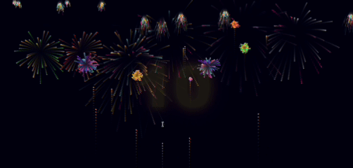
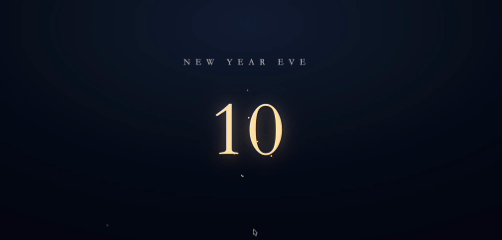
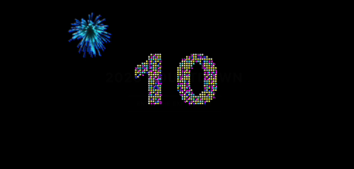

# 🎆 New Year Countdown 🎆

A collection of New Year countdown web experiments built with pure HTML, CSS,
and JavaScript.

This repository explores how timing, motion, sound, and visual rhythm can shape
the emotional experience of the New Year moment — not just as a countdown,
but as a small digital ritual.

---

## ✨ Projects

All countdowns are self-contained static web projects.  
No build tools, frameworks, or dependencies required.

### Kiro
Minimal, clean countdown focused on clarity, rhythm, and smooth transitions.  
→ `Projects/Kiro/`



### Codex
Code-first implementation with clear structure and deterministic behavior.  
→ `Projects/Codex/`



### Antigravity
Experimental visuals exploring motion, particles, and atmosphere.  
→ `Projects/Antigravity/`



### Google AI Studio
Expressive animation-driven countdown refined with Google AI Studio.  
→ `Projects/GoogleAIStudio/`


Each project can be opened directly via its own `index.html`.

---

## ▶️ How to Run

1. Clone or download this repository
2. Open any `index.html` under `Projects/*/` in a modern browser

If your browser restricts local audio playback or asset loading,  
you may serve the files with a simple local static server.

**Example (Python):**

```bash
python3 -m http.server
```

Then open the address shown in your terminal.

## 🧠 Design Notes

- Pure front-end implementation (HTML / CSS / JavaScript)
- No build steps or configuration
- Designed for easy remixing and reuse
- Focused on short-lived, high-impact ritual moments

These projects are intended to be:

- Forked
- Modified
- Reinterpreted for other events or celebrations

Some advanced projects may include optional build steps or tooling.
See each project README for details.


---

## 👤 About the Author

Created by **Flame (FlameAIStudio)**  
Independent product developer & traditional culture enthusiast.

I build web products, visual experiments, and open-source projects,
exploring how modern technology can reinterpret traditional structures
and ritual experiences.

- GitHub: https://github.com/FlameAIStudio
- Website: https://www.flameai.net/

## 📄 License

MIT License
